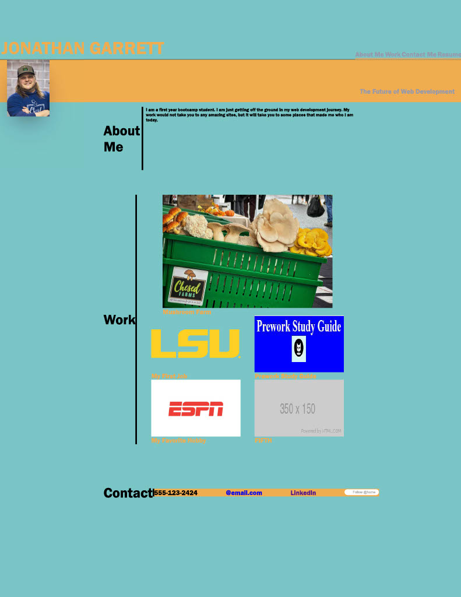

# advanced-css-portfolio

## Description

- I created this page to showcase my career as a software developer.
- As I learn new skill I will add that to the growing list of skills I have on this page.
- I can also use this page as a place to try new things and get ideas onto the page.
- I was really able to understand FlexBox better. I learned many new tips and tricks for CSS and styling text, images, and backgrounds.
This page has navigation bar that links to other places on the page. There are some hover effects and the page is dynamic and changes via media quieres at different size screens.

## Installation

Nothing to Intall. 

## Usage

There is a navigation bar at the top of the page if you would like to quickly access other portions of the webpage.

Added a screenshot so that you will know you are on the write page.

This is a link to my application.
https://jonathanlevi14.github.io/advanced-css-portfolio/

## Credits
I used this tips and tricks page used 
https://css-tricks.com/wp-content/uploads/2022/02/css-flexbox-poster.png

I got some tutoring from Robert Parsons through the tutoring platform in the Trilogy program.

## License
Licensed under the MIT license.

